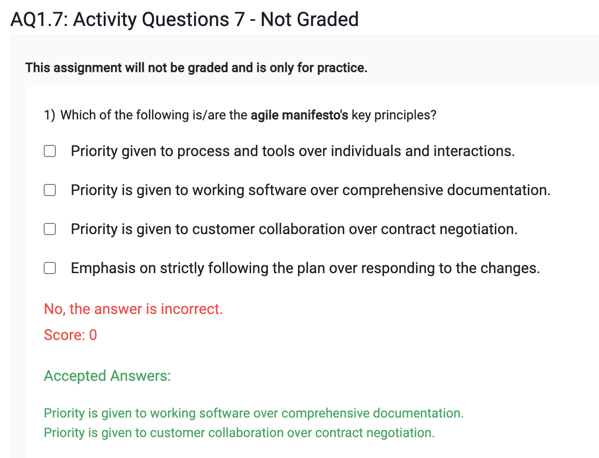
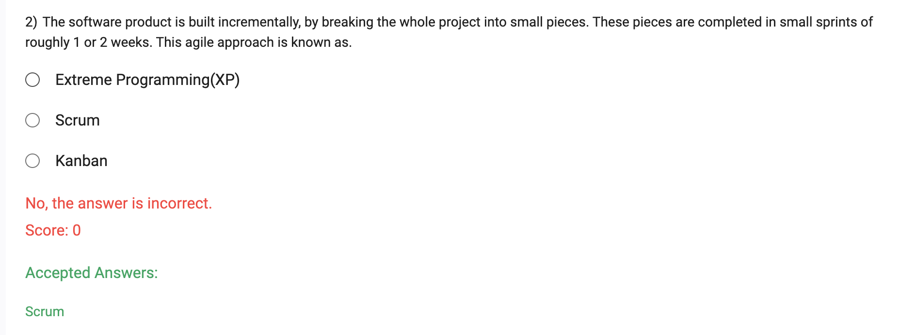

- extreme programming (XP) is a software development methodology which is intended to improve software quality and responsiveness to changing customer requirements
- XP is a type of agile software development
- XP is the most specific of the agile frameworks regarding appropriate engineering practices for software development (e.g., pair programming, test-driven development, etc.)
- Scrum and Kanban are two of the other better-known agile development methodologies
- the term extreme programming was initially used by Ward Cunningham as an umbrella term for various specific software development practices
https://youtu.be/kFM2Vcu-BRo