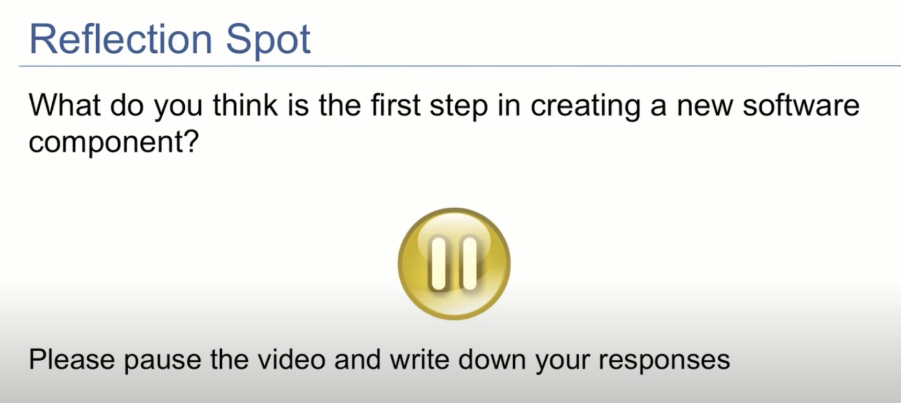
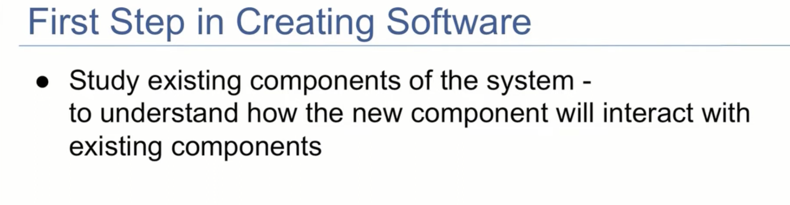
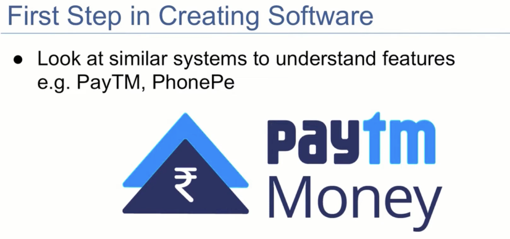
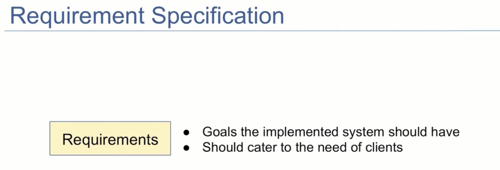
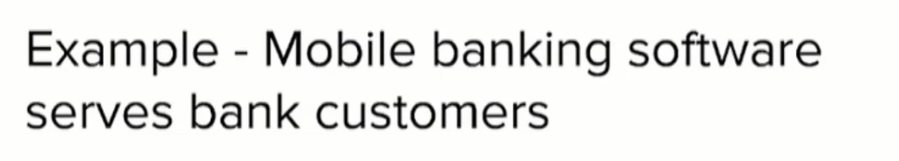
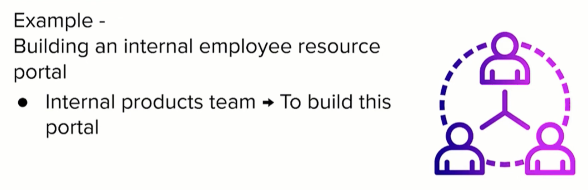
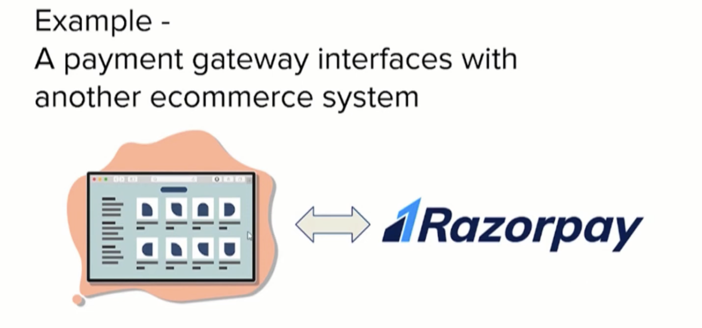
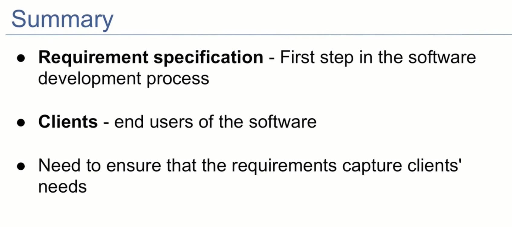

## Software Development Process - Requirement Specification

- a software system is made up of different components which interact with each other to provide the functionality of the system.
- How are these components implemented
    - Amazon wallet
    - How is the wallet implemented
- Amazon pay is a mobile wallet
    - we can link credit and debit cards to the wallet
    - Bank account can be linked to the wallet
    - we can transfer money to amazon pay wallet
    - instead of using credit or debit cards, we can use our smart phones to pay which has this mobile wallet.
    - There are many categories like
        - recharges
        - bill payments
        - travel and insurance
        - electricity
        - water
        - travel
        - reward and gift voucher
    - Mobile wallet has features like adding money and auto reload aswell

    - How did they Started building these systems?
    - How did they come up with these features?

- First step in Creating Software

- Need to understand what problem we need to solve,

- Based on the analysis of existing or similar systems, we need to come up with an explicit set of goals for our own system, for what our own implementation should do.

- Ultimately the software components will be used by different types of users, known as clients
- we need to ensure that the requiremnts cater to their needs

- Who is a client?
    - end user?
    - or someone who comes to buy?
- client could be internal users also,one component could be used by another component.so the client could be another component.
- Client can be external user
    - 
- Client may be internal to your company
    - 
- Client can be another software
    - 

