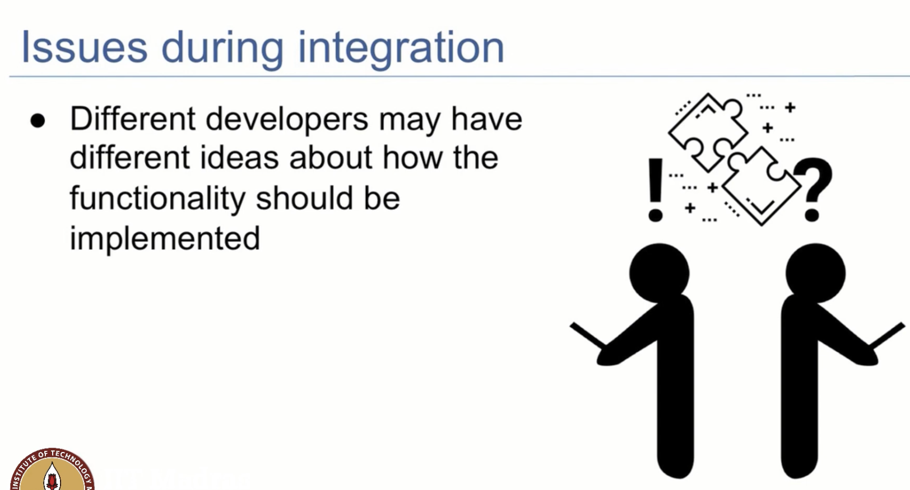
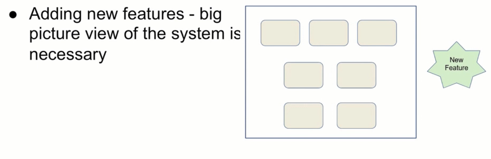
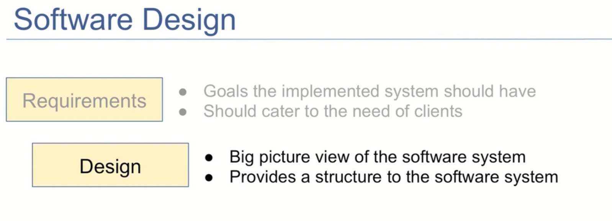
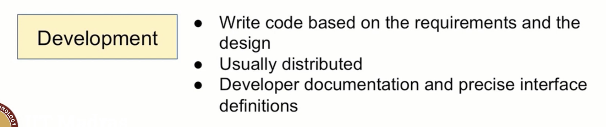

## Software Development Process - Software Design and Development

- Second Step in Creating Software
    - Should we directly jump into coding?
    - what difficulties will we face if we directly jump into coding?
        - we will not know what to do
        - differnet people will do different things
        - add an argument to an existing function, or create a new function
        - this could lead to chaos
- 
- 
- 
- 

- When a feature is implemented, multiple developers will be working on it and write code for the feature
    - they use tools like git hub to manage the code
    - very often coding is done in a distributed manner, as the developers are located in different parts of the world and different time zones,
    - so everyone need to have a consistent understanding of what the code does
    - That the reason why developers write  documentation for the code, And write precise interface definitions
    - What is interface ?
        - it is a description of the actions that the functions can do
        without describing the implementation in detail
        - The interface shows what requests are accepted and  in what format the corresponding response will be given
        - the code implemnted by the interface can change as long as the interface remains the same
    - 