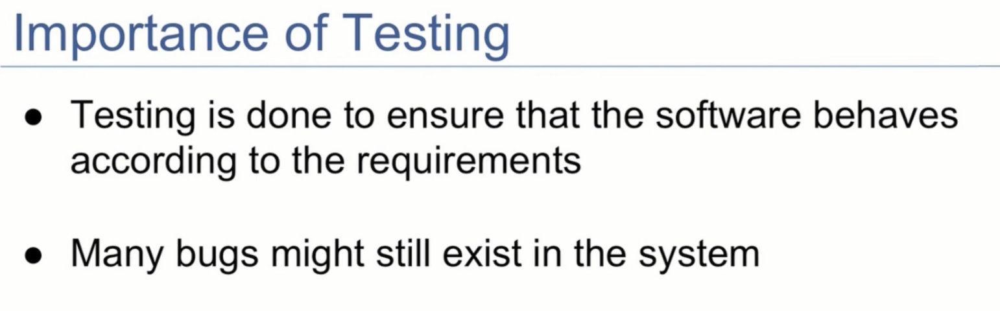
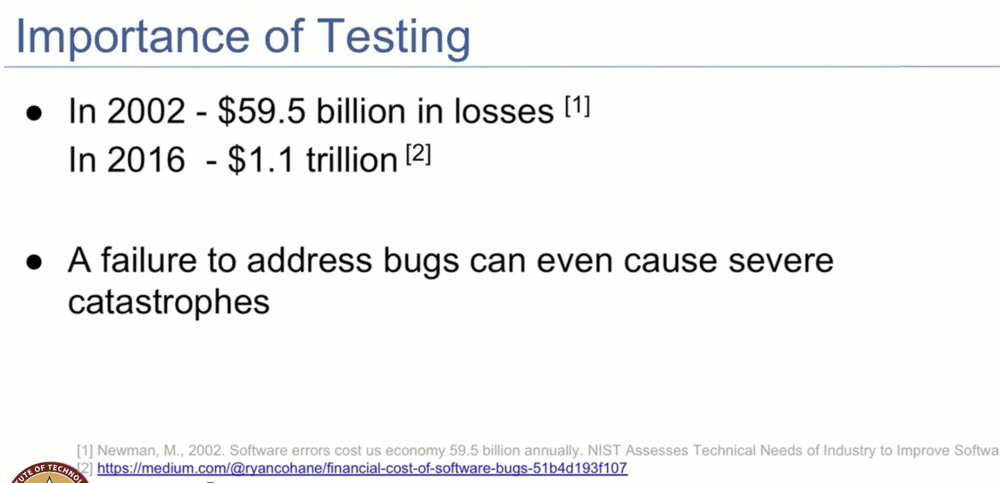
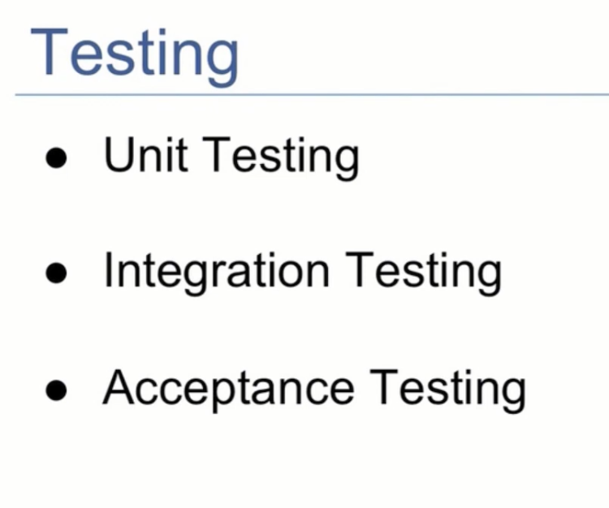
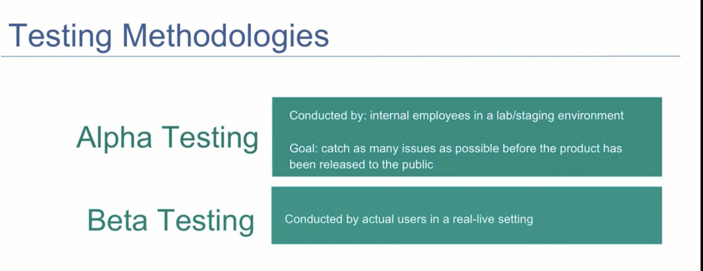
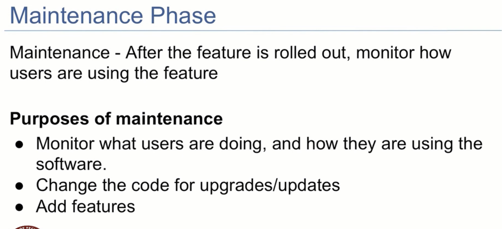
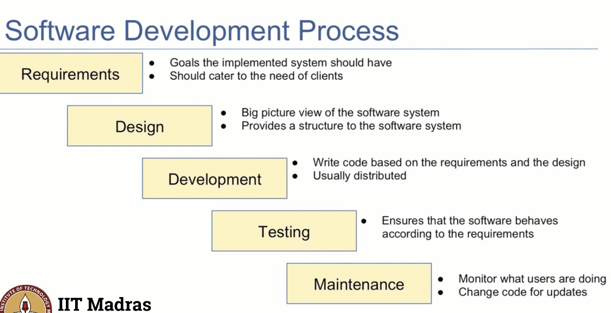

## Testing and Maintenance
- there are two more phases of software development
    - testing 
    - maintenance

- Why is testing important?

- Newman.M,2002 , software errors cost the US economy 59.5 billion dollars annually,
- https://medium.com/@ryancohan/financial-cost-of-software-bugs-51b4d193f107

testing
    - unit testing
        - single part of whole application
        - usually single class or method
    - integration testing
        - test how parts of the app works as a whole
    - Acceptance testing
        - test the whole application
        - usually done by the client

- each week each topic will be seen in detail
- what tools can be user for gathering requirements
- practices for designing the software
- dev process and so on