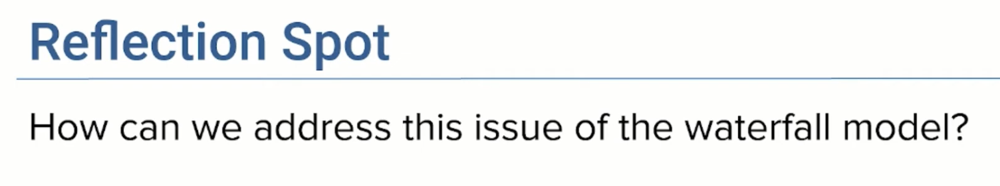
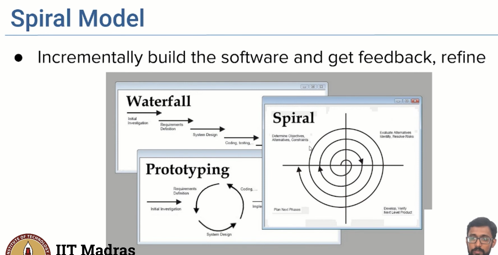

## Software Development Models - Waterfall (Plan and Document) Model

- it is called waterfall because the process flows from one phase to another
- it is known as plan and document model because it is a plan driven model and it is document driven model

- some misunderstanding on the product
- now we need to go back to the requirements phase
- Drawbacks of Waterfall Model
    - 

    - the prototype has limited functional capabilities , and their performance might not been optimal compared to the actual software
    - advantage is that , it is easier for the customers to understand what they want,once they see this prototype
    - also for devs and engineers, how to build it better, once they dev for the first time
    - 

- SPiral model
    - combines the iterative nature of prototyping with the controlled and systematic aspects of the waterfall model
    - at each iteration, the software is developed in a spiral manner, with the requirements being gathered and analyzed in the first phase
    - unlike the waterfall model, the spiral model does not have a fixed sequence of phases
    - there are 4 phases
        - objectives
        - alternatives
        - constraints
        - evaluation
    - then dev, test and release and then plan for next phase
    - So at each iteration, there was a refinement of the prototype, compared to the previous version,
    - unlike waterfall model where we document everything at the beginning,
    the requirement documents are dev across each iteration, as and when needed, eventually evolves into the final product,
    - we also involve customers at the end of every iteration, and this helps reducing the misunderstanding between the customer and the dev team
- Drawback
    - iterations still take long time,(6-24 months)

