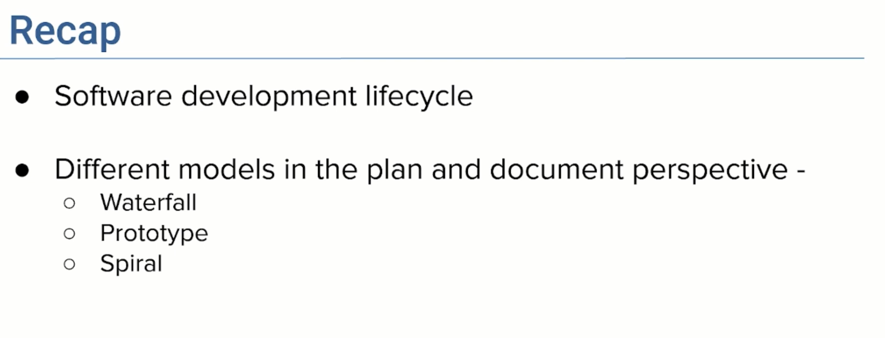
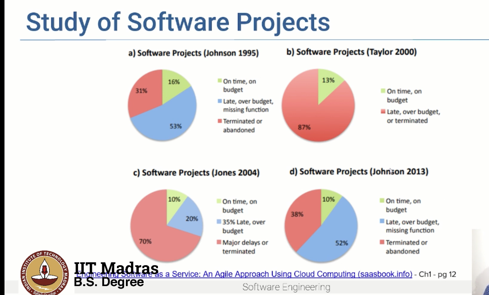
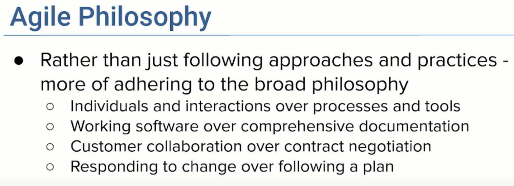
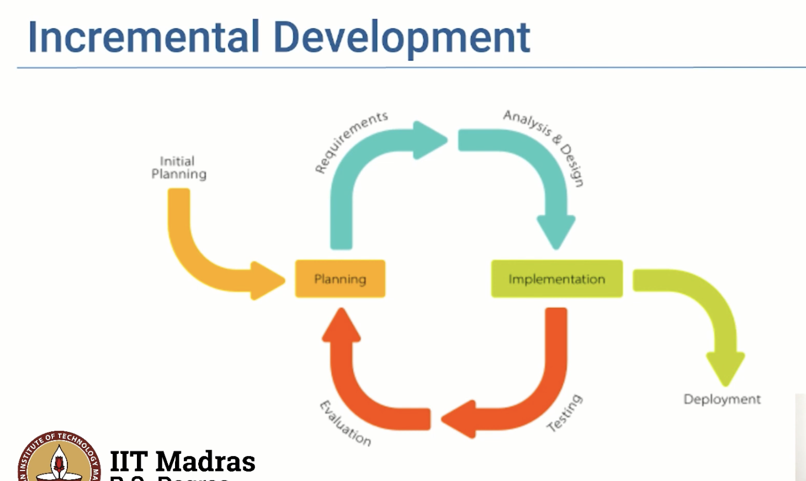
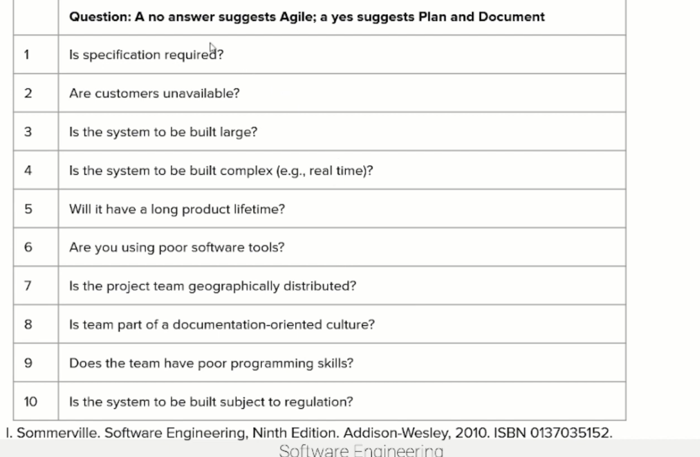

## Software Development - Agile

- although they brought discipline to software development, not very effectivein terms of ontime delivery and being within the budget

- 
    - status of software projects from 1994 to 2013
    - 80-90% of all the software projects are either late or over budget, or simply just abandoned
    - only 10 -15 % of the projects are on time and within budget
    - severe drawbacks of the plan and document approach
- to address these issues, a new approach was proposed in 2001, known as the agile approach
    - it is a lightweight approach
- AGILE MANIFESTO

- 4 key principles
    - it emphasizes on individuals and interactions over processes and tools
        - it is not the tools that are important, but the people who are using the tools
    - rather than comprehensive documentation, it emphasizes on working software
        - rather than spending time on documentation, it is better to have a working software
        - and this is delivered in increments or iterations of 2-4 weeks each time 
    - it emphasizes on customer collaboration over contract negotiation
        - rather than having a contract with the customer, it is better to collaborate with the customer
        - and this is done by involving the customer in the development process
    - it emphasizes on responding to change over following a plan
        - rather than following a plan, it is better to respond to change
        - and this is done by having a flexible plan, which can be changed as and when needed
        
    - INCREMENTAL DEVELOPMENT
        - 
        - instead of waiting till the end to develop a software, we develop prototypes of key features and quickly release the prototypes to the customer for feedback
        - for eg:
            - 1st iteration will be for key features
- Agile Approaches
    - Extreme Programming(XP) (earliest)
        - it has several practices like
            - pair programming
            - test driven development
            - behaviour driven development
    - Scrum
        - products are developed in a series of iterations called sprints
        - each sprint is 2-4 weeks long
        - break down the product into small pieces of user functionality
    - Kanban
        - software to be developed is broken down into small pieces of work items represented in kanban cards, allowing any user to see the state of the work items at any time

- when to use plan and document approach
    - when the requirements are clear and well understood
    - when the technology is well understood
    - when the project is small
- When to use agile approach?

- what are the characteristics that will help us decide which method to use?
    - 
    - IF majority is NO -> Agile
    - IF majority is YES -> Plan and Document