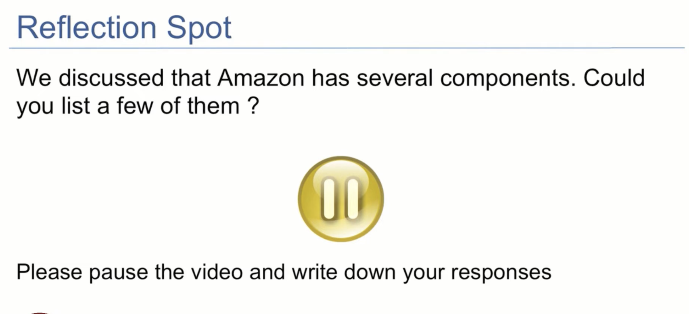
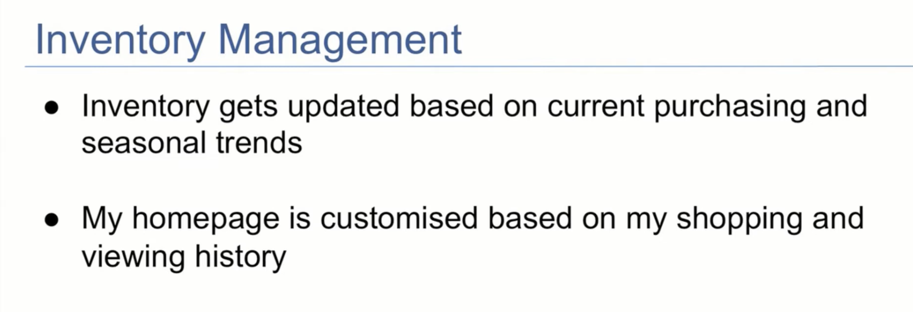
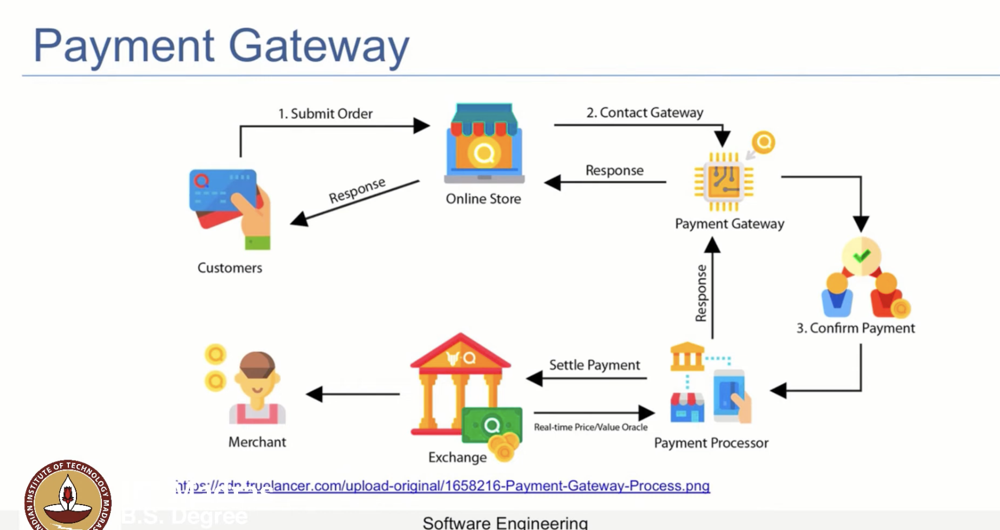
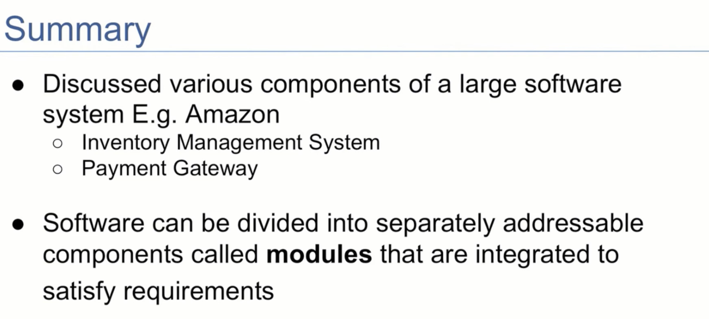

## Thinking of Software in terms of Components

- We are familiar with buying things online
- we are  not surprised when the goods land up at our door step
- behind this there is a huge system
    - vendor
    - logistic person

- how was amazon built, in a monolithic way, or in a component way?
    - monolothic means everything is in one place and one system
    - component means, there are different components, which are working together to make the system work.

- At the start we might not know what are all the features that is needed, but we can start with some features and then add more features as we go along.
- Team will be divided into manageable parts
- Each team will be responsible for a component
- everyone need not know the working of all the component,
- but they should know how to interact with other components.

- COMPONENTS in amazon will be
    - user interface
    - database
    - payment gateway
    - logistics
    - etc

- one major
    - inventory management , (ACT OF measuring the amount location pricing, the mix of products available on amazon)
    
    - Payment gateway
        - wase of payment for both buyer and seller
        
